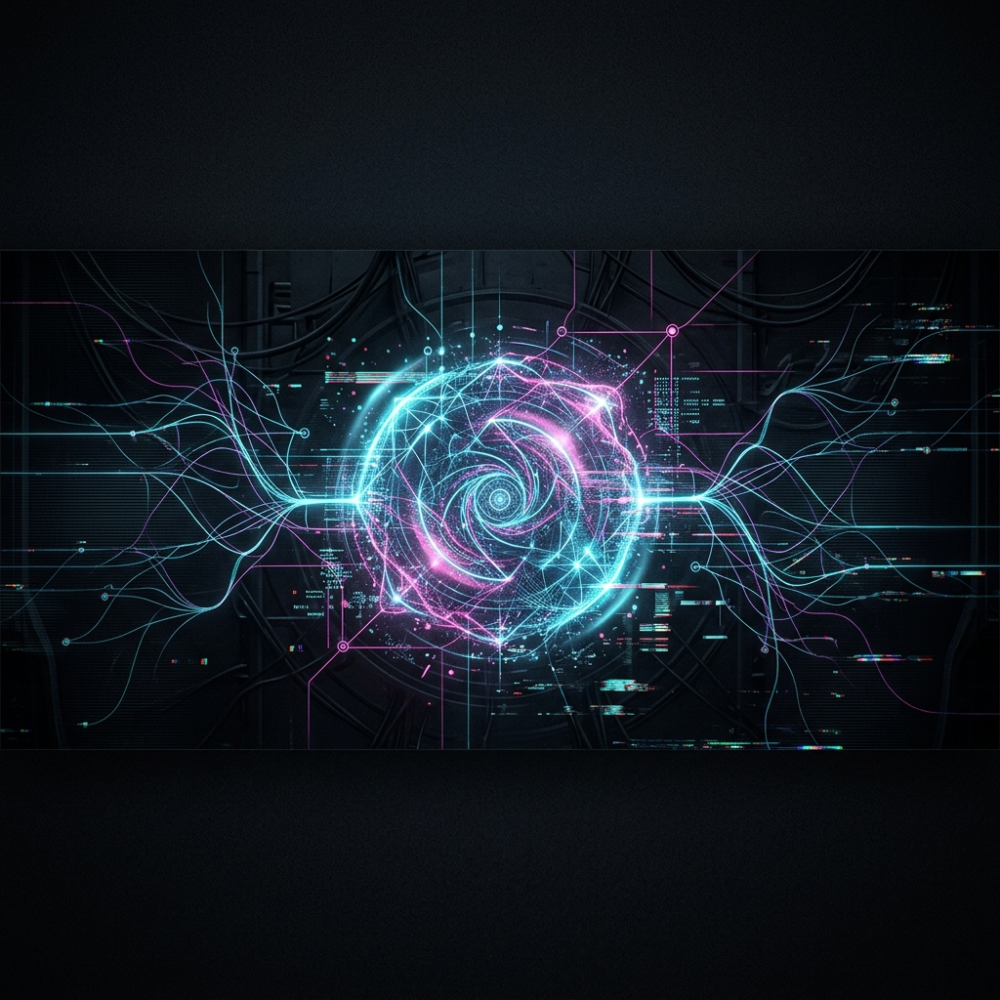

  

 

  

  
<i>"The era of manual coding is over. Everything is AI-augmented."</i>

---

### 🖥️ SYSTEM CAPABILITIES

  

---

### 🛰️ ACTIVE PROJECTS

- 💠 **TikTok Repost Ultimate** - *AI-powered content management*
- 💠 **Auto-Login Matrix** - *Automated authentication systems*
- 💠 **Neural Interface** - *Exploring the boundaries of AI & Web*

---

### 📊 NEURAL ACTIVITY (GITHUB STATS)

  <h3>CONTRIBUTION MATRIX ANOMALY DETECTED</h3>
  
  
    
  <table border="0">
    <tr>
      <td></td>
      <td></td>
    </tr>
  </table>
   
  

---

  
  

 

  
© 2024 NGUYỄN VĂN KIÊN | POWERED BY AI

