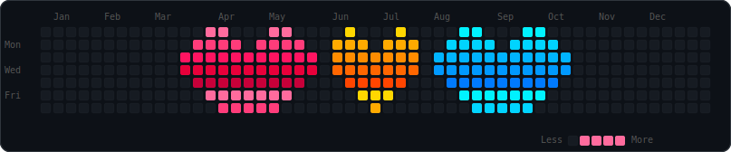
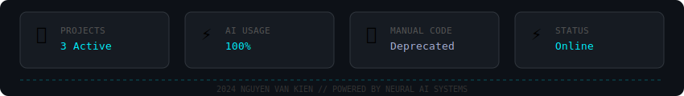

  

  

  

  

  

  

###  &nbsp;ACTIVE PROJECTS

<table>
  <tr>
    <td align="center" width="280">
       
      AI-Powered Content Management
    </td>
    <td align="center" width="280">
       
      Automated Authentication Systems
    </td>
    <td align="center" width="280">
       
      AI &amp; Web Boundary Research
    </td>
  </tr>
</table>

  

### 💖 &nbsp;CONTRIBUTION HEARTBEAT

  

  

###  &nbsp;NEURAL ACTIVITY

  
  

 

  

  

###  &nbsp;TECH STACK

  
  
  
  
  
  

  

  

