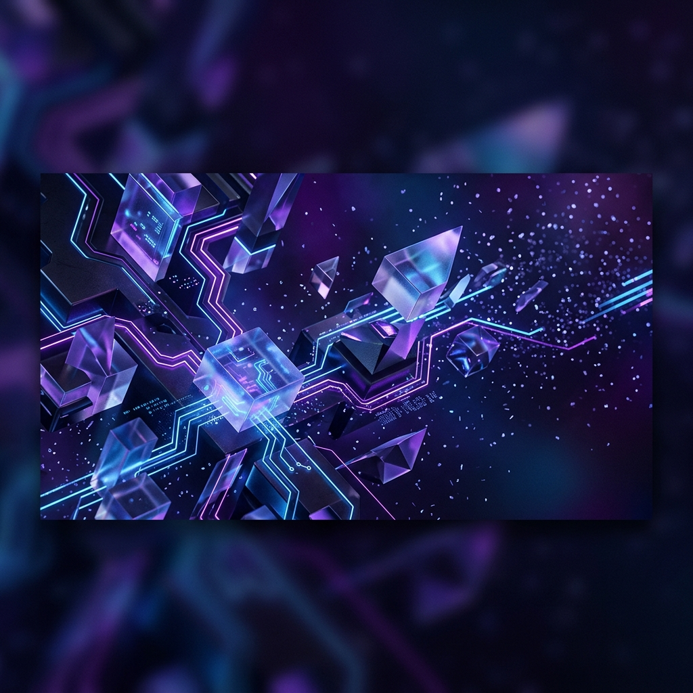

  

  

 

  

---

### 💫 About Me

I'm a **Full-stack Developer** based in Vietnam, specialized in building premium Chrome Extensions and robust automation tools. I love creating software that not only works perfectly but also looks stunning.

- 🔭 I’m currently working on **TikTok Repost Ultimate**
- ⚡ In my free time, I explore **3D Web Design** and **AI Integration**
- 💬 Ask me about **JavaScript, Python, or Extension Development**
- 📫 Reach me at: **kiencuong267@gmail.com**

---

### 🚀 Technologies & Tools

  
  
  
  
  
   
  
  
  
  

---

### 📊 GitHub Stats

  
  
   
  

---

### 🎨 Design Philosophy

> "Code is poetry, and the UI is the stage where it performs."

I believe every line of code should contribute to a seamless and beautiful user experience. My focus is on **performance**, **security**, and **premium aesthetics**.

---

  

